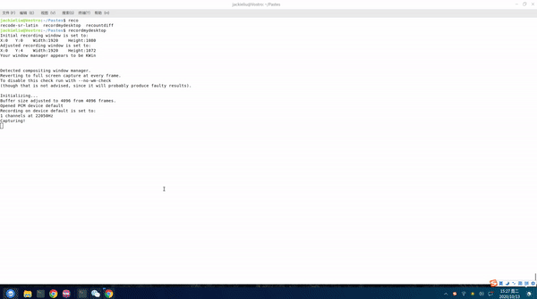

# Pastes

English | [简体中文](./README_cn.md)

 

Thanks for choose pastes.

Pastes is a cross-platform clipboard manager with modern UI design and lowest learning costs. You only need to double-click the `Ctrl` key to call it to serve you.

Pastes can hold the clipboard history within 7 days. You can add it to your system global clipboard by double-clicking or pressing `Enter`. What’s more surprising is that if the focused window can receive clipboard data, Then he will copy the data directly to the focus window.

